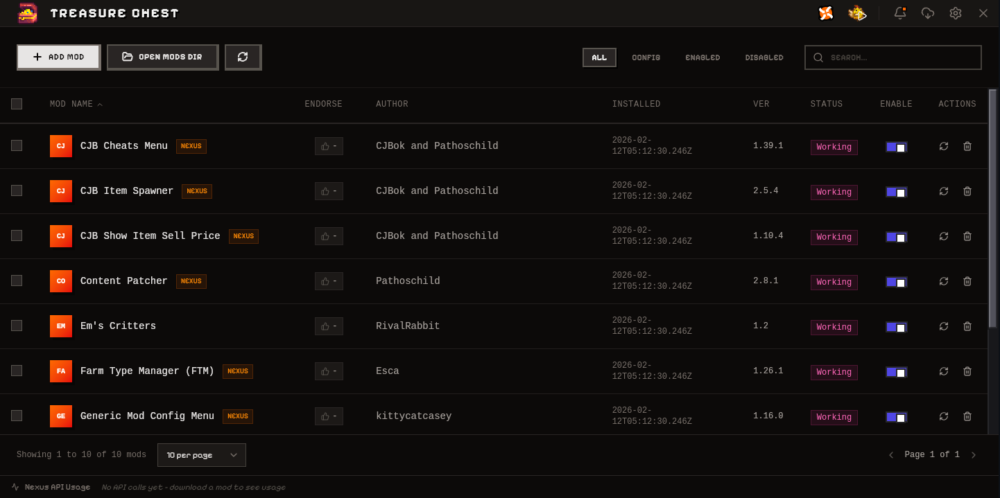

# Stardew Valley Mods Manager

A cross-platform desktop application for managing Stardew Valley mods with seamless Nexus Mods integration.



## About

This mod manager provides a modern, user-friendly interface for managing your Stardew Valley mods. It automatically detects your game installation, scans installed mods, and provides one-click installation from Nexus Mods via the `nxm://` protocol handler.

### Key Features

- 🔍 **Auto-Detection** - Automatically finds your Stardew Valley and SMAPI installations
- 📦 **Mod Management** - Enable, disable, update, and delete mods with ease
- ⬇️ **Nexus Integration** - Download and install mods directly from Nexus Mods using `nxm://` links
- 🔄 **Update Checker** - Automatically checks for mod updates from Nexus Mods
- 🎮 **Game Launcher** - Launch Stardew Valley with SMAPI directly from the app
- 🔎 **Search & Filter** - Quickly find mods by name, author, or status
- 📊 **Bulk Actions** - Enable, disable, or delete multiple mods at once
- 🌐 **API Rate Limiting** - Intelligent API usage tracking to respect Nexus Mods limits
- 💾 **Settings Persistence** - Your configuration is saved locally

## Tech Stack

### Frontend
- **[React 19](https://react.dev/)** - UI library for building interactive interfaces
- **[TypeScript](https://www.typescriptlang.org/)** - Type-safe JavaScript
- **[Vite](https://vite.dev/)** - Fast build tool and dev server
- **[Tailwind CSS 4](https://tailwindcss.com/)** - Utility-first CSS framework
- **[Lucide React](https://lucide.dev/)** - Beautiful icon library

### Backend
- **[Tauri 2](https://v2.tauri.app/)** - Secure, lightweight desktop app framework
- **[Rust](https://www.rust-lang.org/)** - Systems programming language for backend logic
- **[Reqwest](https://docs.rs/reqwest/)** - HTTP client for Nexus Mods API
- **[Serde](https://serde.rs/)** - Serialization/deserialization framework
- **[Tokio](https://tokio.rs/)** - Async runtime for Rust
- **[zip-rs](https://github.com/zip-rs/zip2)** - Zip archive handling

### Key Tauri Plugins
- `tauri-plugin-deep-link` - NXM protocol handler
- `tauri-plugin-single-instance` - Prevents multiple app instances
- `tauri-plugin-dialog` - Native file/folder dialogs
- `tauri-plugin-opener` - Open folders in system file manager

## Setup

### Prerequisites

Before you begin, ensure you have the following installed:

- **[Node.js](https://nodejs.org/)** (v18 or higher)
- **[Rust](https://www.rust-lang.org/tools/install)** (latest stable version)
- **[pnpm](https://pnpm.io/)** or **npm** (package manager)

#### Platform-Specific Requirements

**Linux:**
```bash
# Debian/Ubuntu
sudo apt update
sudo apt install libwebkit2gtk-4.1-dev \
  build-essential \
  curl \
  wget \
  file \
  libssl-dev \
  libgtk-3-dev \
  libayatana-appindicator3-dev \
  librsvg2-dev

# Fedora
sudo dnf install webkit2gtk4.1-devel \
  openssl-devel \
  curl \
  wget \
  file \
  libappindicator-gtk3-devel \
  librsvg2-devel

# Arch
sudo pacman -S webkit2gtk-4.1 \
  base-devel \
  curl \
  wget \
  file \
  openssl \
  appmenu-gtk-module \
  gtk3 \
  libappindicator-gtk3 \
  librsvg
```

**macOS:**
```bash
# Install Xcode Command Line Tools
xcode-select --install
```

**Windows:**
- Install [Microsoft Visual Studio C++ Build Tools](https://visualstudio.microsoft.com/visual-cpp-build-tools/)
- Install [WebView2](https://developer.microsoft.com/en-us/microsoft-edge/webview2/) (usually pre-installed on Windows 11)

### Installation

1. **Clone the repository:**
   ```bash
   git clone https://github.com/yourusername/sdv-mods-manager.git
   cd sdv-mods-manager
   ```

2. **Install dependencies:**
   ```bash
   npm install
   ```

3. **Run in development mode:**
   ```bash
   npm run app:dev
   ```

### Building for Production

Build the application for your platform:

```bash
# Linux
npm run app:build:linux

# Windows
npm run app:build:windows

# macOS
npm run app:build:macos
```

The compiled application will be in `src-tauri/target/release/bundle/`.

## Configuration

### Nexus Mods API Key

To enable mod updates and downloads from Nexus Mods, you'll need to configure your API key:

1. Get your API key from [Nexus Mods](https://www.nexusmods.com/users/myaccount?tab=api)
2. Open the app settings (⚙️ icon)
3. Paste your API key in the "Nexus API Key" field
4. Save settings

### Game Paths

The app will attempt to auto-detect your Stardew Valley and SMAPI installations. If auto-detection fails, you can manually configure:

- **Game Path**: Directory containing `Stardew Valley.exe` or `StardewValley`
- **SMAPI Path**: Path to the SMAPI executable

## Usage

### Installing Mods from Nexus

1. Browse mods on [Nexus Mods](https://www.nexusmods.com/stardewvalley)
2. Click "Mod Manager Download" button
3. The app will automatically receive the `nxm://` link, download, and install the mod

### Managing Mods

- **Enable/Disable**: Toggle the switch next to each mod
- **Update**: Click the update icon to check for newer versions
- **Delete**: Click the trash icon to remove a mod
- **Bulk Actions**: Select multiple mods using checkboxes for bulk operations

### Launching the Game

Click the "Launch Game" button (🎮) in the header to start Stardew Valley with SMAPI.

## Development

### Project Structure

```
sdv-mods-manager/
├── src/                      # React frontend source
│   ├── components/          # UI components
│   ├── features/            # Feature-specific components
│   ├── types/               # TypeScript type definitions
│   └── hooks/               # Custom React hooks
├── src-tauri/               # Rust backend source
│   ├── src/
│   │   ├── lib.rs          # Main Tauri commands
│   │   ├── models.rs       # Data models
│   │   ├── settings.rs     # Settings management
│   │   ├── download_manager.rs  # Download queue
│   │   ├── mod_installer.rs     # Mod installation logic
│   │   └── nxm_protocol.rs      # NXM URL parsing
│   └── Cargo.toml          # Rust dependencies
├── public/                  # Static assets
└── package.json            # Node dependencies
```

### Development Scripts

```bash
# Start dev server (frontend only)
npm run dev

# Start Tauri app in dev mode
npm run app:dev

# Build frontend only
npm run build

# Preview production build
npm run preview

# Type check
npx tsc --noEmit
```

## Contributing

Contributions are welcome! Please feel free to submit a Pull Request.

## License

This project is licensed under the MIT License.

## Recommended IDE Setup

- [VS Code](https://code.visualstudio.com/)
  - [Tauri](https://marketplace.visualstudio.com/items?itemName=tauri-apps.tauri-vscode)
  - [rust-analyzer](https://marketplace.visualstudio.com/items?itemName=rust-lang.rust-analyzer)
  - [ES7+ React/Redux/React-Native snippets](https://marketplace.visualstudio.com/items?itemName=dsznajder.es7-react-js-snippets)
  - [Tailwind CSS IntelliSense](https://marketplace.visualstudio.com/items?itemName=bradlc.vscode-tailwindcss)
